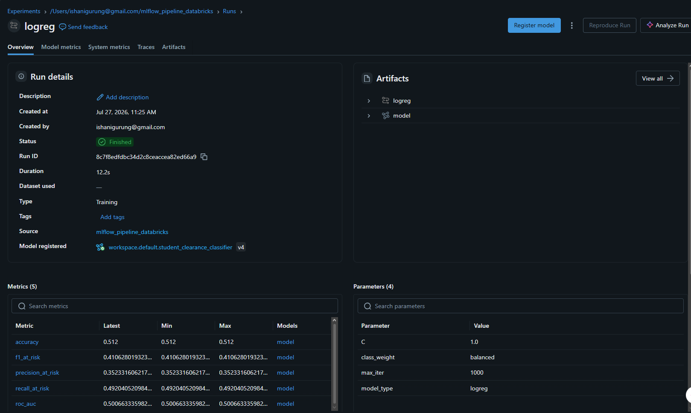
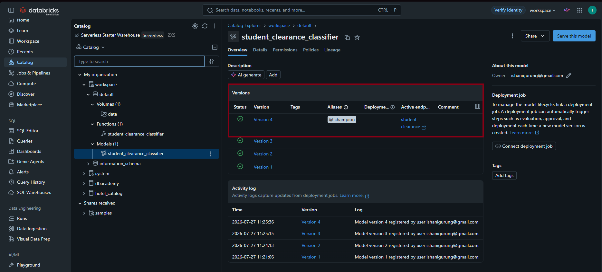
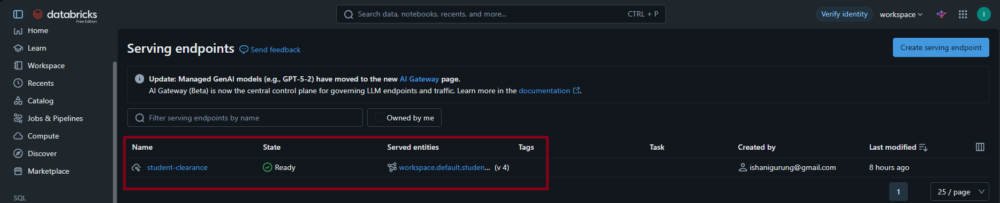
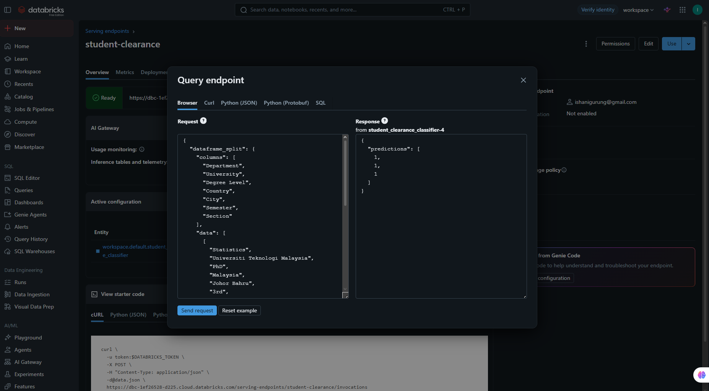
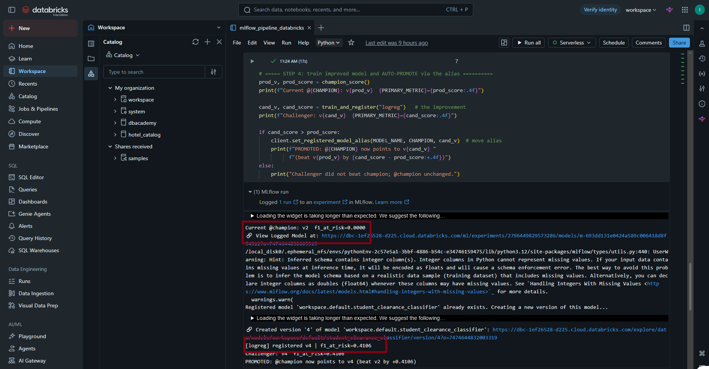

# Automated MLOps Champion-Challenger Pipeline — Student Academic Clearance

## Project Summary

This project implements a production-grade Machine Learning Operations (MLOps) pipeline for
**Student Academic Clearance Prediction**. Instead of training a one-off model in a notebook,
the repository delivers a full lifecycle management system built on **MLflow**, hosted on
**Databricks (Free Edition)** with the Unity Catalog Model Registry and serverless Model Serving.

It establishes a naive baseline model, registers it, exposes it as a live REST inference
endpoint, and runs an automated **Challenger** step that trains a stronger model, compares it
against the deployed **Champion** on a chosen metric, and programmatically moves the
`@champion` alias to the new version if it performs better — with no manual intervention.

The same pipeline can also be run locally with open-source MLflow (see `src/`). This repo is
meant as a clear, honest blueprint for taking a model from raw data to a deployable,
self-updating service.

---

## Repository Structure
├── data/
│ └── global_student_academic_status.csv # Student clearance dataset (10,000 rows)
├── databricks/
│ └── mlflow_pipeline_databricks.py # Full lifecycle notebook (UC + serving)
├── src/
│ ├── data_prep.py # Leakage-safe load + train/test split
│ ├── train.py # Baseline training + registration
│ ├── promote.py # Automated Challenger evaluation
│ └── predict_request.py # Simulated client for REST API testing
├── analysis/
│ └── signal_check.py # Evidence that features carry no signal
├── screenshots/ # Proof of execution
├── PROJECT_OBJECTIVE.md # Objective + model justification
├── DATABRICKS_SETUP.md # Databricks Free Edition setup
├── README.md
└── requirements.txt

---

## Dataset Context

- **Source:** [University Academic Clearances & Pending Courses (Kaggle)](https://www.kaggle.com/datasets/fa23bst011/university-academic-clearances-and-pending-courses)
- **Target Variable:** derived from `Pending Type` — `1` = Cleared ("All Clear"), `0` = At-risk (Fail / Withdraw / Dropped / Not Registered)
- **Size:** 10,000 rows, 7 predictive features (Department, University, Degree Level, Country, City, Semester, Section)

The classes are moderately imbalanced (~65% cleared / 35% at-risk). Two columns
(`No. of Pending Courses`, `Pending Courses Name`) are direct restatements of the target and
are **dropped to prevent data leakage** — training on them would produce a meaningless
"perfect" model.

---

## The "Why": Architecture & Methodology

### 1. Why F1-Score over Accuracy?

With imbalanced data, accuracy is deceptive. A model that predicts "Cleared" for everyone
scores ~65% accuracy while flagging **zero** at-risk students — the exact students the system
exists to help. The promotion logic therefore relies on the **F1-Score for the at-risk class**
(`f1_at_risk`), which balances precision and recall.

### 2. Why these specific Models?

- **The Baseline (Champion v1):** a `DummyClassifier(strategy="most_frequent")`. It always
  predicts the majority class, producing high accuracy (0.65) but a naive `f1_at_risk` of
  **0.00**. It exists to prove that accuracy hides real-world failure.
- **The Challenger:** a `LogisticRegression` with `class_weight="balanced"`. It reaches
  `f1_at_risk` = **0.41**, beating the baseline and earning automatic promotion.

### 3. Why MLflow?

MLflow decouples the model from the code. Through its Model Registry and REST serving, models
become version-controlled, traceable, and instantly deployable. On Databricks this is extended
by the **Unity Catalog** registry, which uses **aliases** (`@champion`) instead of the
deprecated Production/Staging stages.

### 4. An Honest Note on Model Performance

Absolute scores here are low **by design, not by mistake**. Statistical testing
(`analysis/signal_check.py`) shows the features are effectively independent of the target:
chi-square p-values of 0.3–0.97, mutual information ≈ 0, and a cross-validated ROC-AUC of
**0.506** (chance is 0.50). The dataset is synthetic and carries no learnable signal, so no
honest model can beat chance. The pipeline's value is the **lifecycle and correct
methodology**; documenting this ceiling is better engineering than inflating the score through
leakage. Full reasoning in [`PROJECT_OBJECTIVE.md`](PROJECT_OBJECTIVE.md).

---

## Step-by-Step Guide & Milestones

### Step 1: Establishing the Naive Baseline (Milestone 1)

We train a Dummy (majority-class) model as the baseline "Champion". As expected, it shows
respectable accuracy but a `f1_at_risk` of 0.00 — proof it blindly predicts the majority
class. It is logged and registered to the MLflow Model Registry and tagged `@champion`.


*Milestone 1: model tracked in MLflow with all five metrics.*


*Model registered to the Unity Catalog Model Registry with the `@champion` alias.*

### Step 2: Productionizing via REST API (Milestone 2)

The Champion is deployed as a live REST serving endpoint (`student-clearance`) on Databricks.
Sending a JSON payload of student records to the `/invocations` endpoint returns live
predictions (`{"predictions": [1, 1, 1]}` — 1 = cleared, 0 = at-risk).


*Milestone 2: Champion model exposed as a REST endpoint, in Ready state.*


*The served model returning live JSON inferences.*

### Step 3: Automated Lifecycle Management (Milestone 3)

The `promote.py` script (and the Databricks notebook's promotion cell) acts as an automated
agent. It trains a challenger, fetches the current Champion's `f1_at_risk`, compares them on
the same test set, and moves the `@champion` alias to the new version **only if the challenger
wins**. Because the challenger scored 0.41 (beating the naive 0.00), it was promoted
automatically.


*Milestone 3: Challenger (F1: 0.41) beat the Champion (F1: 0.00); the `@champion` alias was
programmatically transferred to the new version.*

---

## Technical Challenges & Troubleshooting

Several real engineering issues were resolved while building this on Databricks Free Edition:

1. **Untrusted types on model registration:** MLflow 3's model-trust check rejected an internal
   scikit-learn `ColumnTransformer` type (`RemainderColsList`). The fix was to drop the
   `ColumnTransformer` and one-hot encode the full frame with a single `OneHotEncoder`.
2. **`order_by` unsupported in Unity Catalog:** `search_model_versions(...)` with `order_by`
   fails against the UC registry; the version is read from `info.registered_model_version`.
3. **Stages vs. Aliases:** Unity Catalog does not support legacy Production/Staging stages; it
   uses aliases (`@champion`). The Databricks notebook uses aliases; the local `src/` scripts
   use stages — same lifecycle, correct mechanics per host.
4. **Python 3.14 dependency build failures:** on Python 3.14, `pyarrow` had no prebuilt wheel
   and failed to compile. The fix was to use a supported Python (3.11/3.12).

---

## Future Scope

- **Containerization (Docker):** package the tracking server and inference API for environment parity.
- **Continuous Integration (GitHub Actions):** trigger challenger evaluation automatically on new data.
- **Scheduled retraining on Databricks:** run the champion-challenger cycle on a cadence.

---

## How to Run This Pipeline

### Option A — Databricks (Free Edition)

Upload `data/global_student_academic_status.csv` to a Unity Catalog Volume, import
`databricks/mlflow_pipeline_databricks.py` as a notebook, attach serverless compute, and
**Run all**. Full guide in [`DATABRICKS_SETUP.md`](DATABRICKS_SETUP.md).

### Option B — Local (open-source MLflow)

```bash
git clone https://github.com/hellcat101/student-clearance-mlflow.git
cd student-clearance-mlflow
pip install -r requirements.txt
python src/train.py --model-type baseline      # baseline (Champion v1)
python src/promote.py --model-type logreg       # improve + auto-promote
mlflow ui --port 5000                           # view tracking UI
```

To reproduce the "no signal" evidence: `python analysis/signal_check.py`.

---

Author: **Ishani Gurung**